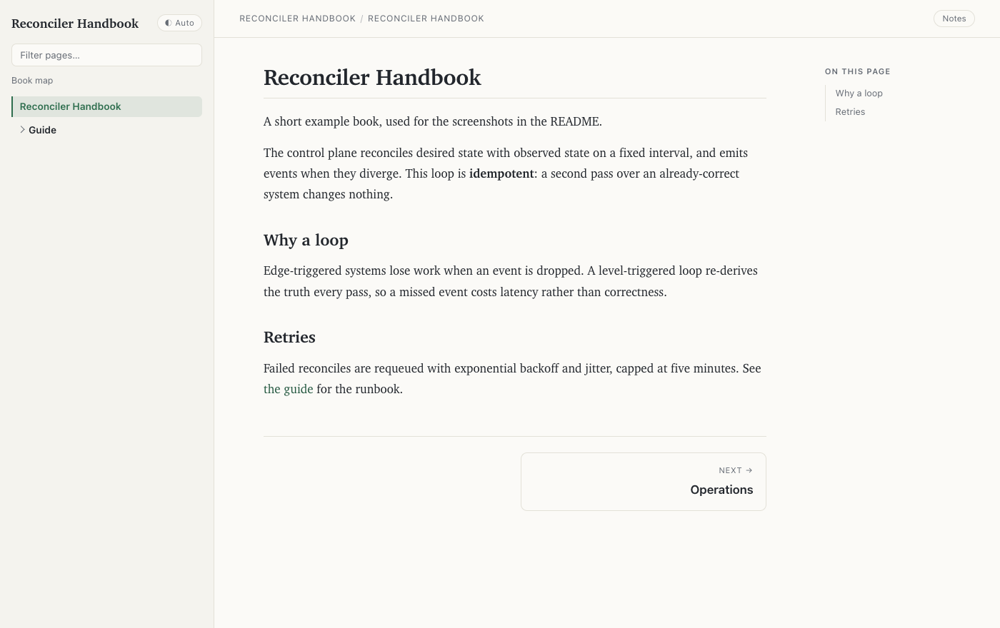
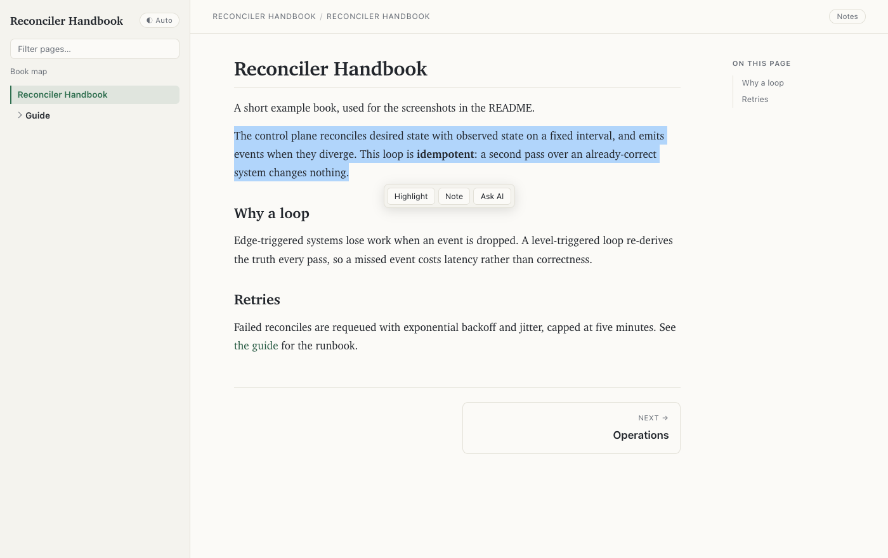
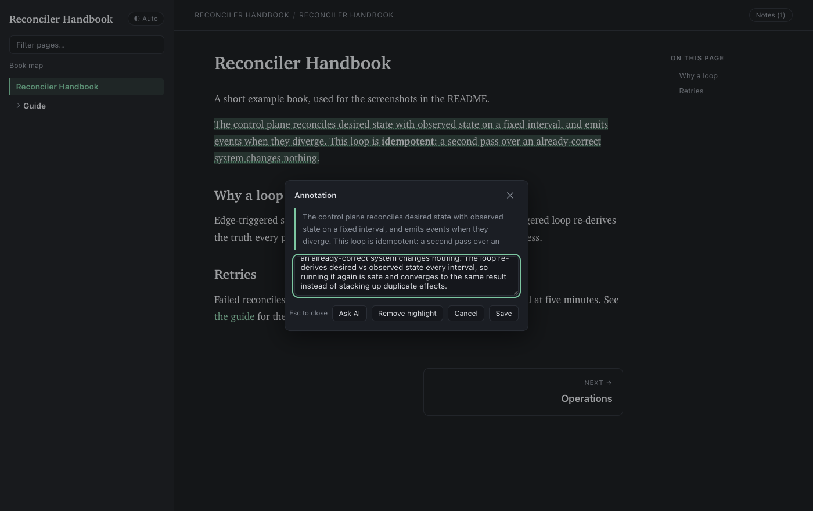
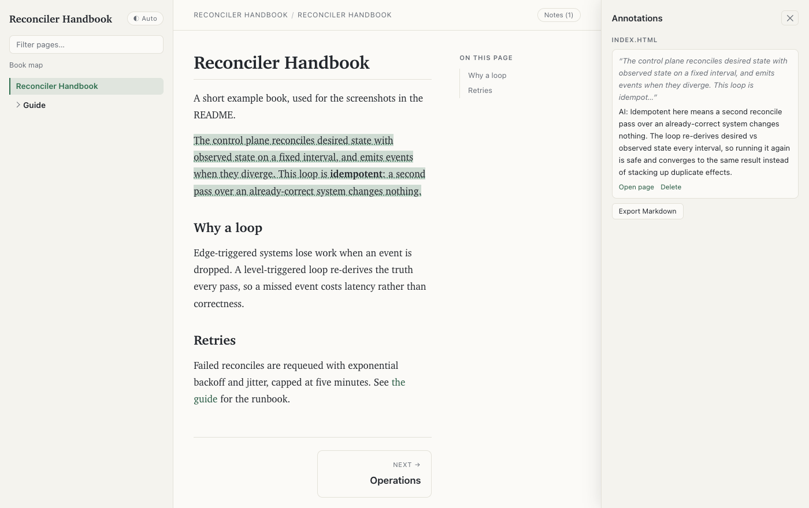
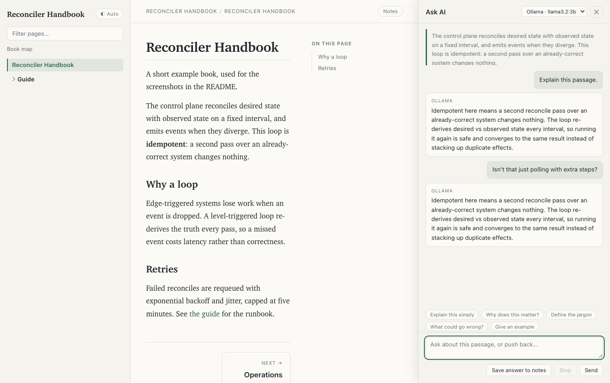
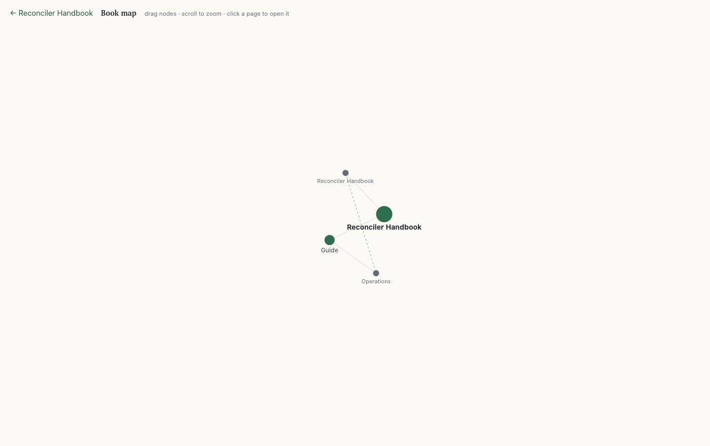

# bookify

Point it at a folder of docs and get a browsable book — in HTML **and** Markdown.
No config file, no scaffolding, no site generator to learn.

```bash
bookify ./docs
```

That builds the book, opens it in your browser, and stops the server when you
close the last tab.



It handles mixed folders: Markdown, plain HTML pages, `.txt`/`.rst`/`.adoc`, and
optionally source code. Cross-links between formats are rewritten so `.md ↔
.html` links keep working, and images the pages reference are copied along with
them.

---

## Install

Needs [uv](https://docs.astral.sh/uv/) — dependencies are declared inline
(PEP 723), so there's no venv to create.

```bash
curl -LsSf https://astral.sh/uv/install.sh | sh   # if you don't have uv
install -m 755 bookify ~/.local/bin/bookify       # anywhere on your PATH
```

On a network that intercepts TLS, uv needs the system trust store for its first
dependency fetch: `export UV_NATIVE_TLS=1`.

## Usage

```bash
bookify                               # render the current directory and serve it
bookify <folder>                      # build to ~/.cache/bookify/<name>-<hash>/ and serve
bookify <folder> --no-serve           # build only — use this from scripts and agents
bookify <folder> --serve 9000         # serve on a specific port
bookify <folder> --keep-alive         # don't auto-stop when browser tabs close
bookify <folder> -o /path/out         # custom output dir
bookify <folder> --format html        # html | md | both (default: both)
bookify <folder> --title "My Docs"    # book title (default: folder name)
bookify <folder> --include-code       # render source files as highlighted pages too
bookify <folder> --ai [MODEL]         # add an AI overview page via local Ollama
bookify <folder> --ask-provider ID    # force the Ask AI backend
bookify <folder> --no-ask             # turn the Ask AI sidebar off
```

Output lives outside the folder you scanned (`~/.cache/bookify/` by default), so
rendered artifacts never pollute a repo. Every output directory also gets a
`.gitignore` containing `*` as a safety net for custom `-o` paths.

## Reading features

### Highlights and notes

Select any text to highlight it or attach a note.



Click a highlight to edit or remove it; re-select over one and the toolbar
offers **Unhighlight** directly. The editor closes via the ✕, the backdrop,
`Esc` or *Cancel* — none of which change the annotation.





### Where your state lives

Notes are kept in **two places at once**, and either one can rebuild the other:

| Store | Scope | Survives |
|---|---|---|
| **IndexedDB** (`bookify` database) | the browser origin, partitioned by book id | the output directory being deleted, `~/.cache` being cleared, rebuilds |
| **`annotations.json`** next to the book | that book's output directory | browser data being cleared, a different port, a different browser, opening the book off disk |

The reason for both: IndexedDB is scoped to an *origin including the port*, so a
book served on `--serve 9000` is a different database from the same book on
8123 — and some browsers give `file://` pages no IndexedDB at all. The JSON file
is port-independent, so it carries your notes across. On every page load the two
are merged, and the merged result is written back to both.

Each book gets a stable id derived from its source path, so it keeps its own
rows even when several books share one origin (which is what happens when you
render different folders on the default port). Renaming with `--title`, moving
the output, or rebuilding does not change it.

Deletes are recorded as tombstones rather than simply dropped — a missing record
is indistinguishable from one the other store has not seen yet, so without them
a deleted note could come back on the next merge. They are pruned after 30 days.

Ask AI conversations are stored too, one thread per passage, so reopening a
highlight brings the discussion back rather than starting over.

If IndexedDB is unavailable (private windows, site data blocked), bookify falls
back to `localStorage`, and to the server file alone if that is blocked as well.

Annotations survive rebuilds and export to Markdown from the Notes panel.

### Ask AI

Select a passage and hit **Ask AI** to open a chat sidebar about it. It opens
with an explanation and then takes follow-ups, so you can question the answer or
argue with it.



- The passage plus ~700 characters either side go along as context, so answers
  stay grounded in the page rather than in the model's general knowledge.
- **Save answer to notes** attaches the reply to that highlight.
- **Stop** cancels a reply mid-stream and keeps the partial text; `Esc` or ✕
  closes the panel.

**It uses whatever is already on your machine** — nothing to configure. bookify
probes for, in order:

| Backend | How it's used |
|---|---|
| **Ollama** | `/api/chat`, streaming token by token. Free and local. |
| **Claude Code** (`claude`) | `claude -p`, streamed |
| **Codex** (`codex`) | `codex exec`, final message |
| **Gemini** (`gemini`) | `gemini -p`, streamed |

The startup banner tells you what it found and what it picked:

```
Ask AI:        Ollama (llama3.2:3b), Claude Code (CLI)  — using Ollama
```

A dropdown in the panel switches backend per question. If nothing is installed
the button simply doesn't appear — likewise when the book is opened straight off
disk over `file://`, which has no server to proxy through.

Point `BOOKIFY_OLLAMA` elsewhere (default `http://127.0.0.1:11434`) to use
Ollama on another port or machine.

> **Note:** the CLI backends spend whatever quota that CLI is on. `--no-ask`
> disables the feature; `--ask-provider ollama` keeps everything local.

### Book map

An interactive force-directed map of the folder structure plus the cross-links
between pages. Drag nodes, scroll to zoom, click a page to open it.



### Everything else

Theme toggle (auto/light/dark), on-page outline with scroll-spy, a sidebar
filter that hides folders it empties, copy buttons on code blocks, and keyboard
navigation — arrows page through the book, `/` focuses the filter.

## Output layout

```
<out>/
  html/          static site — open index.html
  markdown/      SUMMARY.md (contents), one page per file, BOOK.md (all in one)
  annotations.json   your notes — preserved across rebuilds, mirrored to IndexedDB
```

`BOOK.md` is the whole book in a single file, which makes it a convenient blob
of context to hand to an LLM.

## Security notes

The server binds to `127.0.0.1` only. Because Ask AI shells out to local
assistant CLIs, every request must carry a random per-run token that is handed
out only to the book's own pages — so nothing else in your browser can invoke a
CLI on your machine.

## Tests

```bash
./tests/test_bookify.py                                        # build + server suite
uv run --with playwright tests/test_bookify.py --browser       # plus the UI suite
```

The default suite is stdlib-only and takes about a second. `--browser` drives a
real browser through the annotation and Ask AI flows; it reuses any chromium
already in your Playwright cache, or tells you to run `playwright install
chromium`. Every check corresponds to a bug that was actually found and fixed.

## License

MIT — see [LICENSE](LICENSE).
